**The Source-Informed Segmentation Plugin**

**for Brainstorm Toolbox**

by **Ali Haddad**

1.  **About the Plugin:**

This plugin employs the *Source-Informed Segmentation Algorithm* \[1\]
in the temporal segmentation of EEG files within the Brainstorm toolbox
\[2\]. The plugin segments the EEG data in the files passed to it and
returns a new set of files, with the processed EEG data marked by the
detected segment boundaries as extended events, which can be found in
the (.Event) field of each processed file. Furthermore, the parameters
and secondary outcomes of the *Source-Informed Segmentation Algorithm*
and other options used by the plugin are saved to the (.SISegment) field
added to each of these processed files (see section 6). The processed
files are added back to the Brainstorm workspace. Additionally, the
plugin collects various statistics which summarize the performed
segmentation processes. The statistics are displayed after the
completion of all segmentation processes, and can optionally be saved to
a user selected file.

The plugin can be applied either to one set of files, to be processed
and statistically summarized together, or to two sets of files, to be
equivalently processed then compared using the same statistical
measures.

For citation, see \[1\] below. The Source-Informed Segmentation Plugin
for Brainstorm Toolbox can be found
[here](http://eceweb1.rutgers.edu/~laleh/#/database).

2.  **Installing the Plugin:**

Copy the two files:

"process_SISegmentationMD.m" and "process_SISegmentationMD2.m",

intended to perform *Source-Informed Segmentation* under "Process1" and
"Process2" tabs, respectively, to the Brainstorm user process folder:

"\$HOME/.brainstorm/process".

3.  **Running the Plugin:**

-   Run the "brainstorm" toolbox from MATLAB's command window.

-   Select the EEG files to be processed from the "Functional data" pane
    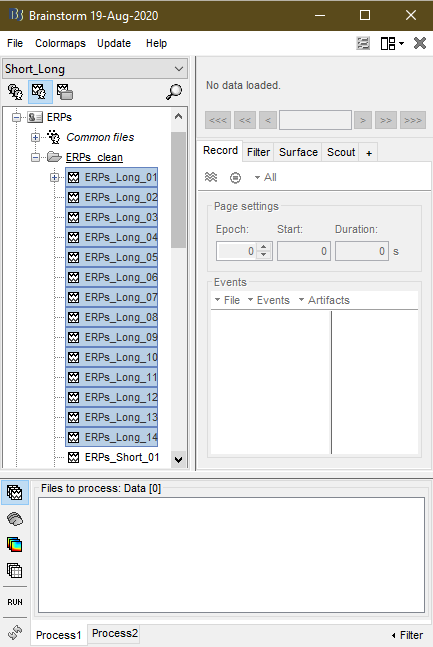{width="0.29in" height="0.26in"}.

{width="2.6666666666666665in"
height="3.9846052055993in"}

-   Drag the selected files then drop them in the "Files to process:
    Data \[#\]" pane of the "Process1" tab, for them to be processed
    together,

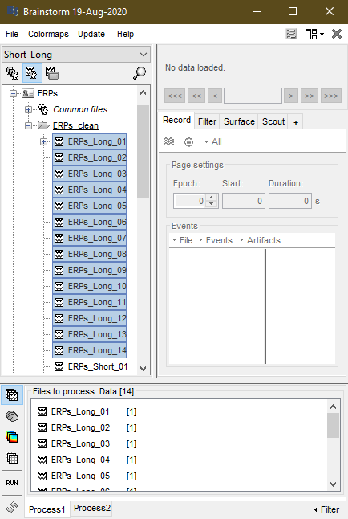{width="2.6666666666666665in"
height="3.9692793088363953in"}

or either the "Files A: Data \[#\]" or "Files B: Data \[#\]" pane of the
"Process2" tab, for them to be compared to the files in the other pane
of the latter tab (two sets of files will be needed for this
comparison).

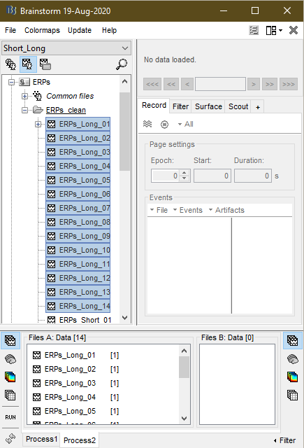{width="2.6979166666666665in"
height="3.9693503937007875in"}

Dropping files adds them to the files already existing in the given
pane. The number of total files eligible for processing in each pane
(denoted as \# above) should appear inside the square brackets.

-   Press the "RUN" button {width="0.31in"
    height="0.28in"} near the lower left corner of the Brainstorm
    toolbox window to bring the "Pipeline editor".

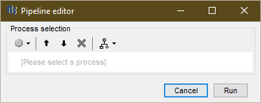{width="3.8963768591426073in"
height="1.5418821084864391in"}

-   Press the "Add process" button
    {width="0.3229166666666667in"
    height="0.3125in"} to bring the drop-down list of available
    processes.

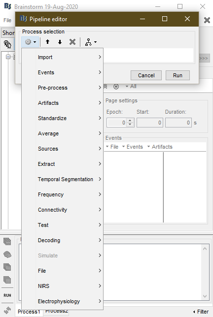{width="2.669255249343832in"
height="3.9791666666666665in"}

-   From "Temporal Segmentation" choose "Source-Informed Segmentation"
    to bring the "Process options" window. Maximize the window if the
    "Cancel" and "Run" buttons do not appear in the lower right corner.

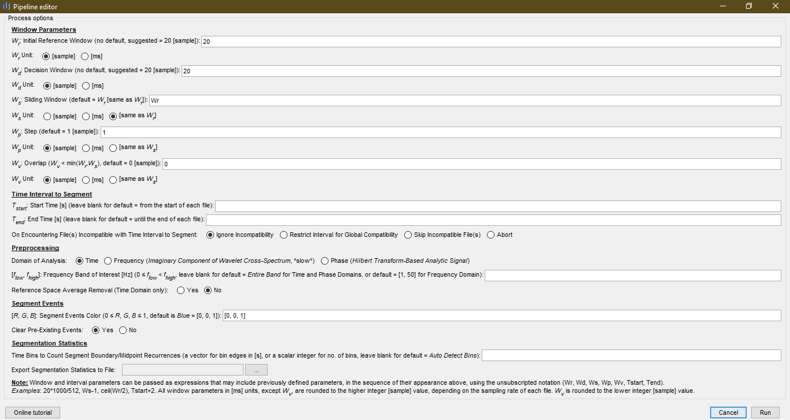{width="6.499354768153981in"
height="3.4590277777777776in"}

-   Enter the values and/or make the choices relevant to the intended
    *Source-Informed Segmentation* process. Note that the window will
    remember the last values and choices. To reset these to their
    corresponding defaults, in the "Pipeline editor" window press the
    "Load/save processing pipeline" button
    {width="0.38in" height="0.26in"}, then from
    the drop-down list choose "Reset options".

-   After entering/making all the relevant values/choices, press the
    "Run" button to start the *Source-Informed Segmentation* process.

4.  **Plugin Parameters and Options:**

    A.  [Window Parameters]{.underline}

These parameters define the widths of the corresponding windows (see
section 5) used by the *Source-Informed Segmentation Algorithm* \[1\].
They are passed in either \[sample\] or \[ms\] units, or, in the case of
some of them, in the same unit used to pass some other window's width.
The radio button below the input field of each window parameter
specifies its unit.

-   Initial Reference Window ($W_{r}$): the initial width of the
    reference window, where $W_{r} > 0$.

-   Decision Window ($W_{d}$): the minimum number of consecutive
    possible boundaries needed for one of them to be considered a
    detected boundary, where $W_{d} > 0$.

-   Sliding Window ($W_{s}$): the width of the sliding window, where
    $W_{s} > 0$.

-   Step ($W_{p}$): the amount of each discrete expansion in the width
    of the reference window and the corresponding shift in the position
    of the sliding window, where $W_{p} > 0$.

-   Overlap ($W_{v}$): the width of the overlap between the reference
    and the sliding window, where $0 \leq W_{v} < min(W_{r},W_{s})$.

    A.  [Time Interval to Segment]{.underline}

Using these options, the interval to be cropped out of the EEG files
towards processing can be defined, if cropping is needed. If one or both
interval limits are undefined, the corresponding limits are assigned the
beginning or the end of the individual EEG files.

-   Start Time ($T_{start}$): the starting point, in \[s\], of the
    cropping interval.

-   End Time ($T_{end}$): the ending point, in \[s\], of the cropping
    interval.

-   On Encountering File(s) Incompatible with Time Interval to Segment:
    this option defines the action to take when one or more EEG files
    have time intervals that do not cover one or both limits of the
    cropping interval. The radio button can assume one of the following
    values:

    -   Ignore Incompatibility: proceed with the part of the cropping
        interval that is covered by each EEG file.

    -   Restrict Interval for Global Compatibility: redefine the
        cropping interval as the intersection of the intervals of all
        EEG files and the cropping interval to ensure compatibility
        across all files, if possible.

    -   Skip Incompatible File(s): do not process incompatible files.

    -   Abort: if any incompatible file is encountered, abort without
        processing any file, regardless of their possible compatibility.

    A.  [Preprocessing]{.underline}

These options allow for various processes to be applied to the EEG data
prior to attempting to detect segment boundaries.

-   Domain of Analysis: select the domain within which the
    *Source-Informed Segmentation Algorithm* \[1\] is to be applied.
    These domains are:

    -   Time: with a functional connectivity measure equivalent to
        correlation.

    -   Frequency: with a functional connectivity measure equivalent to
        the imaginary component of coherence, using an analytical Morlet
        wavelet-based filter-bank.

    -   Phase: with a functional connectivity measure equivalent to
        phase-locking value (PLV), in terms of the analytical signal
        calculated using Hilbert transform.

-   Frequency Band of Interest ($\lbrack f_{low},f_{high}\rbrack$): if
    specified, define the low and high limits in \[Hz\] of the band-pass
    filter applied to the EEG data prior to segmentation, with
    $0 \leq f_{low} < f_{high}$. When $f_{low} = 0$ or
    $f_{high} \geq f_{s}/2$, where $f_{s}$ is the sampling rate, a
    high-pass or low-pass filter, respectively, is applied, instead.

-   Reference Space Average Removal: whether to remove the channel-wise
    average of the reference window before calculating the reference
    space (in the time domain) or not.

    A.  [Segment Events]{.underline}

These options apply to the segment boundary events to be added to the
individual EEG files to be processed.

-   Segment Events Color ($\lbrack R,G,B\rbrack$): the color of the
    added segment boundary events in RGB format, where
    $0 \leq R,G,B \leq 1$.

-   Clear Pre-Existing Events: whether to clear the events already saved
    in the individual EEG files to be processed or not.

    A.  [Segmentation Statistics]{.underline}

These options apply to the statistics collected from the processed EEG
files.

-   Time Bins to Count Segment Boundary/Midpoint Recurrences: if
    specified as a vector or a scalar, it is used to define the edges or
    the number, respectively, of the time bins within which the average
    numbers of segment boundaries/midpoints are counted.

-   Export Segmentation Statistics to File: if specified, a (.mat) file
    with the statistics collected from the processed EEG files is
    created and saved.

5.  **About the Source-Informed Segmentation Algorithm:**

The *Source-Informed Segmentation Algorithm* \[1\] detects the instants,
in the EEG data, at which the functional state of the brain changes. To
achieve that, the algorithm compares the EEG activity within two
windows: the *reference window*, initially of width $W_{r}$, and the
*sliding window*, of constant width $W_{s}$. The two windows have an
*overlap* of constant width $W_{v}$. Each comparison may reveal either a
*possible boundary* or *not a boundary*.

$$W_{r}$$

previous detected boundary

$$W_{s}$$

?

**1** (possible boundary)

**0** (not a boundary)

$$W_{v}$$

As consecutive comparisons are made, the reference window grows in a
*step* of constant width $W_{p}$, each time, pushing the sliding window
by the same step to keep the overlap constant. A boundary is detected
when at least $W_{d}$, the width of the *decision window*, consecutive
possible boundaries are found. The *detected boundary* corresponds to
the possible boundary with the maximum likelihood, as determined by the
comparison.

**1**

**0**

**1**

**1**

**1**

$$W_{d}$$

**1**

$$W_{p}$$

6.  **The Contents of the (.SISegment) Field of Processed EEG Files:**

This field saves the following parameters and secondary outcomes of the
*Source-Informed Segmentation Algorithm* \[1\] and other options used by
the plugin when applied to an EEG file:

-   $W_{r}$: the width of the initial reference window.

-   $W_{d}$: the width of the decision window.

-   $W_{s}$: the width of the sliding window.

-   $W_{p}$: the step width.

-   $W_{v}$: the width of the overlap between the reference and sliding
    windows.

-   unit: the unit of the window parameters.

-   Domain: the domain of *Source-Informed Segmentation*.

-   Band: the frequency band of interest
    ($\lbrack f_{low},f_{high}\rbrack$), if specified.

-   AvRemove: the reference space average removal option.

-   svals: (1 × no. segments) cell array with vectors carrying the set
    of significant singular values corresponding to each detected
    segment.

-   svecs: (1 × no. segments) cell array with matrices carrying the set
    of significant left singular column vectors corresponding to each
    detected segment.

-   erat: (1 × no. segments) vector with the ratios of energy captured
    by the sets of significant singular values corresponding to each
    detected segment.

-   pval: (1 × no. segments) vector with the $p$-vaues calculated at the
    detected segment boundaries, based on the Kolmogorov-Smirnov (K-S)
    test.

-   avsegs: (no. of EEG channels × no. segments) matrix with the average
    EEG topography of each detected segment.

-   stdsegs: (no. of EEG channels × no. segments) matrix with the
    channel-wise standard deviation of the EEG signal within each
    detected segment.

-   label: the label of the corresponding segment boundary events.

7.  **A Tutorial Example:**

Here, two sets of files, placed in "Files A: Data \[#\]" and "Files B:
Data \[#\]" panes of the "Process2" tab, are processed, separately,
using the *Source-Informed Segmentation* plugin.

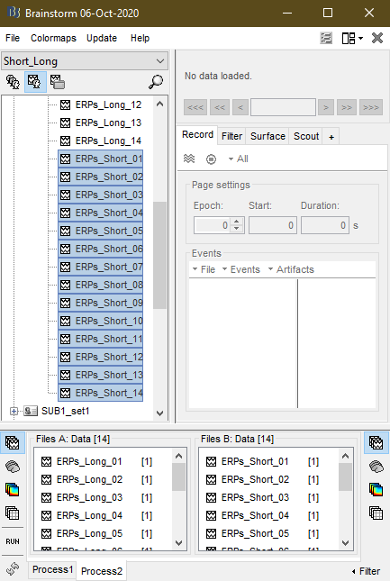{width="2.71in" height="4.03in"}

The window parameters used with the *Source-Informed Segmentation
Algorithm* \[1\] are:

-   $W_{r} = 20$ \[sample\], $W_{d} = 20$ \[sample\], $W_{s} = 20$
    \[same as $W_{r}$\], $W_{p} = 1$ \[sample\], and $W_{v} = 0$
    \[sample\].

To process the interval 0 -- 2 s from each EEG file, or whatever
sub-interval of it a file covers, the following options are used with
the plugin:

-   $T_{start} = 0$, $T_{end} = 2$, and "Ignore Incompatibility".

Furthermore, EEG data is to be processed in the "Time" domain, within
the *δ*, *θ*, and *α* bands. Thus, the Frequency Band of Interest is
chosen as:

-   $\left\lbrack f_{low},f_{high} \right\rbrack = \lbrack 1,\ 16\rbrack$.

For statistical summarization, segment boundaries/midpoints are counted
within the:

-   Time Bins: $0:0.1:2$.

The statistics are then saved to a (.mat) file that is created and named
using the browse button 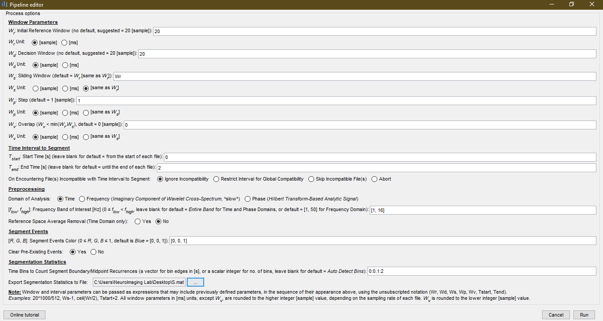{width="0.42in"
height="0.23in"}.

{width="6.5in" height="3.4618055555555554in"}

After processing the EEG files in both panes, separately, the processed
files appear in the "Functional data" pane, with their original names
appended by " \| SIS".

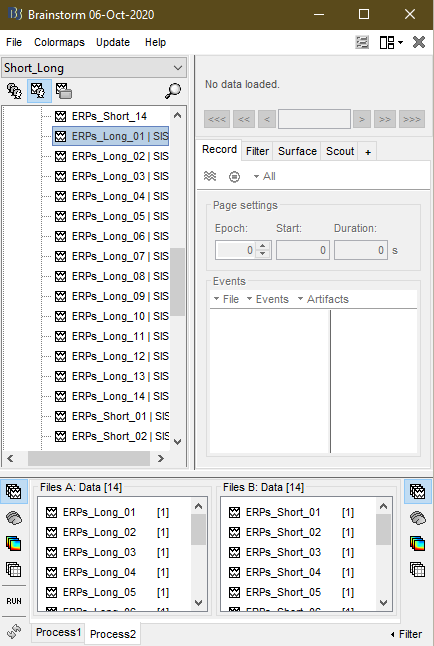{width="2.71in" height="4.04in"}

Note that the segment boundary events of a given processed EEG file can
be viewed using Brainstorm's own viewer, invoked by double-clicking the
file, and own event display formats. Below, the segment boundary events
are shown as labeled "Dots" in blue
($\lbrack R,G,B\rbrack = \lbrack 0,\ 0,\ 1\rbrack$), the color the
plugin options dictated earlier. Brainstorm offers different EEG and
event viewing modes that can be controlled through the list accessible
by clicking the "Display Configuration" button
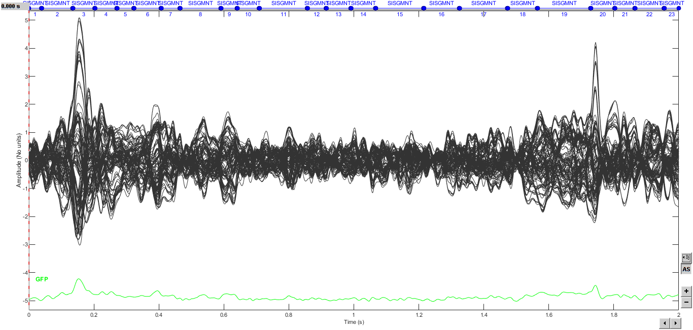{width="0.23in" height="0.23in"} near the lower
right corner of the viewer window.

{width="6.5in" height="3.0972222222222223in"}

The plugin also summarizes the statistics collected from the
*Source-Informed Segmented* EEG files in each of the two sets "Files A"
and "Files B", using 8 plots that are grouped into two figure windows.
In the case of "Process2", each plot is used to compare the files in the
two sets. In the non-comparative case of "Process1", each plot
corresponds to the entire set of EEG files that would be placed in the
"Files to process: Data \[#\]" pane. The statistics used in the
aforementioned plots can also be exported to the file that was specified
by the corresponding plugin option. The files saved in the cases of
"Process1" and "Process2" are the same, in terms of the structures they
contain. The main difference constitutes in the fields of these
structures that are intended for the main data entries, which, in the
case of "Process2" consist of two sub-fields themselves: (.A) and (.B)
for the corresponding file panels. Some structures also include
additional test results, *e.g.*, $p$-values and Peasrson correlation
coefficients, which give context-relevant comparisons between "Files A"
and "Files B", in the case of "Process2".

The first figure window includes:

-   Average No. of Segment Boundaries: the average number of segment
    boundaries, per EEG file (trial), occurring during each of the time
    bins. These bins are controlled by the corresponding plugin option
    entered earlier. The data in this plot is saved to the structure
    "HistSegmentBoundaries".

-   Segment Length vs. Beginning Boundary: a scatter plot of all segment
    lengths vs. their corresponding beginning boundaries, across all EEG
    files. The data in this plot can be calculated from the contents
    saved in the structure "SegmentBoundaries". In the case of
    "Process2", a bivariate K-S test is conducted to compare "Files A"
    to "Files B" in terms of segment length/boundary pairs. The
    $p$-value of the test is shown in the plot, and is saved to the
    field "HistSegmentBoundaries.BiKSpvalue".

-   Average No. of Segment Midpoints: the average number of segment
    midpoints, per EEG file (trial), occurring during each of the time
    bins. These bins are controlled by the corresponding plugin option
    entered earlier. The data in this plot is saved to the structure
    "HistSegmentMidPoints".

-   Segment Length vs. Midpoint: a scatter plot of all segment lengths
    vs. their corresponding midpoints, across all EEG files. In the case
    of "Process2", a bivariate K-S test is conducted to compare "Files
    A" to "Files B" in terms of segment length/midpoint pairs. The
    $p$-value of the test is shown in the plot, and is saved to the
    field "HistSegmentMidPoints.BiKSpvalue".

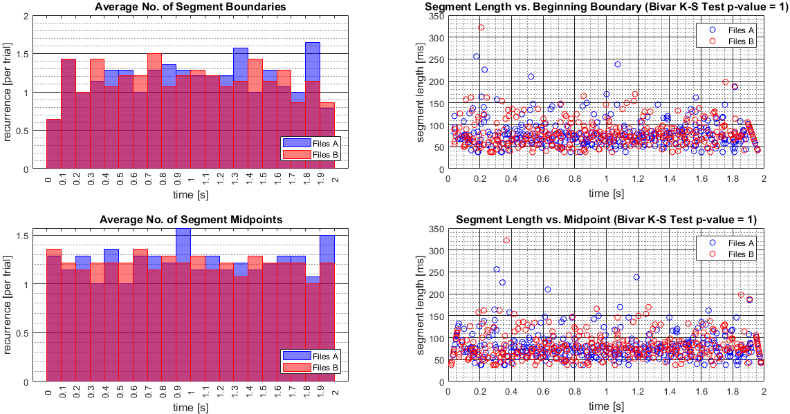{width="6.5in" height="3.4090277777777778in"}

The second figure window includes:

-   Average Length of Encompassing Segment: the average length of the
    segment, across all EEG files (trials), which contain a given time
    sample, calculated dynamically at each time sample. Also plotted,
    here, is one corresponding dynamically calculated standard deviation
    above and below the average curve. The overall mean (*µ*) and
    standard deviation (*σ*) of each curve is shown in the plot. In the
    case of "Process2", Pearson correlation coefficient of the two
    curves is calculated and shown in the plot. The data in this plot is
    saved to the structure "DynamicSegmentLength". Similarly, the
    dynamic average/standard deviation of the duration until the end of
    the encompassing segment, at a given time sample, is calculated and
    saved to the structure "DynamicDurationtoSegEnd", without being
    plotted.

-   PMF of Segment Lengths: the histogram, *i.e.*, empirically estimated
    probability mass function (PMF), of all segment lengths throughout
    all EEG files (trials). The average (Av) and standard deviation (SD)
    of all segment lengths are shown in the plot. The histogram is also
    fitted to a Burr distribution with parameters $c$, $k$, and *α*, all
    shown in the plot. The goodness of fit is evaluated through a
    $\chi^{2}$ test and the $p$-value of it is shown in the plot. The
    histogram, the probability density function (PDF) of the approximate
    Burr distribution, and the outcomes of the $\chi^{2}$ test are saved
    to the structure "HistSegmentLengths". In the case of "Process2", a
    K-S test is conducted to compare "Files A" to "Files B" in terms of
    the segment lengths. The $p$-value of this test is shown in the
    plot. The segment lengths used in this plot and the $p$-value of the
    K-S test are saved to the structure "AllSegmentLengths".

-   Maximum Segment Length vs. Beginning Boundary: a scatter plot of the
    maximum length of the segments in each EEG file (trial) vs. their
    corresponding beginning boundaries. The average (Av) and standard
    deviation (SD) of the maximum lengths, across all EEG files, are
    shown in the plot. The data in this plot is saved to the structure
    "MaxSegmentLengths".

-   Minimum Segment Length vs. Beginning Boundary: a scatter plot of the
    minimum length of the segments in each EEG file (trial) vs. their
    corresponding beginning boundaries. The average (Av) and standard
    deviation (SD) of the minimum lengths, across all EEG files, are
    shown in the plot. The data in this plot is saved to the structure
    "MinSegmentLengths".

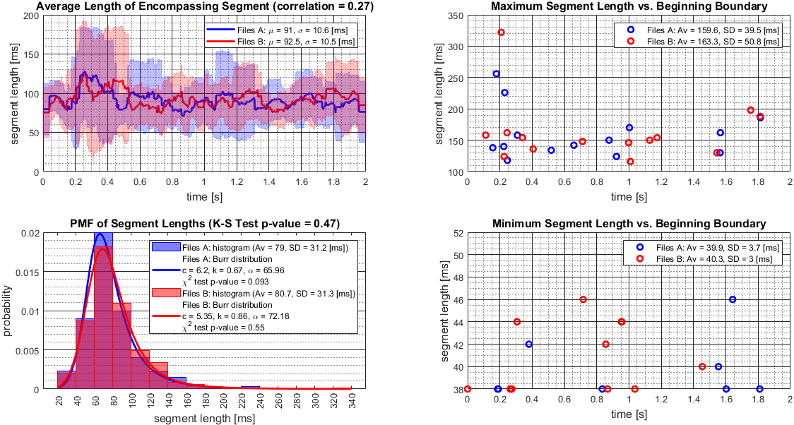{width="6.5in" height="3.48125in"}

**References:**

1.  [Ali E. Haddad and Laleh Najafizadeh, \"Source-informed
    segmentation: A data-driven approach for the temporal segmentation
    of EEG,\" *IEEE Transactions on Biomedical Engineering*, vol. 66,
    no. 5, pp. 1429-1446,
    2019.](https://ieeexplore.ieee.org/abstract/document/8481379)

2.  <https://neuroimage.usc.edu/brainstorm/Introduction>
